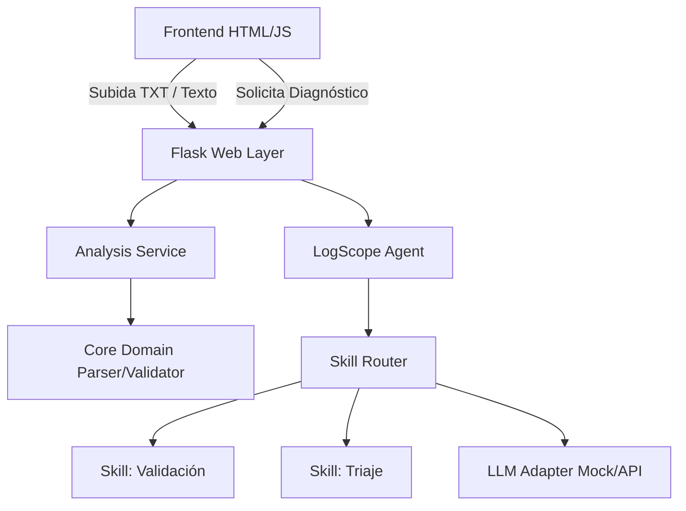

# LogScope Web
**Desarrollado por: Rodrigo Rosa**

LogScope es una herramienta de análisis de logs diseñada bajo la filosofía de que "La IA es una herramienta, no un autor". Fue creada como parte del  Curso AI for Developers, separando estrictamente la lógica de validación de la interfaz gráfica.

## Arquitectura
El proyecto fue refactorizado siguiendo principios de **Arquitectura Limpia**, separando el sistema en capas:

- **Core**: Lógica de validación pura, regex y excepciones.
- **Application**: Servicio de coordinación y serialización.
- **Web**: Flask App Factory y rutas HTTP.
- **Agent & Skills**: Enrutamiento de prompts y ejecución de habilidades aisladas (`LogScopeAgent`).



## ¿Cómo ejecutar el proyecto?
1. Abre tu terminal o consola en esta carpeta.
2. Asegúrate de tener instalado Flask:
   ```bash
   pip install flask
   ```
3. Copia `.env.example` a `.env` (opcional, utiliza proveedor `mock` por defecto).
4. Ejecuta el servidor:
   ```bash
   python main.py
   ```
5. Abre tu navegador y dirígete a: **http://localhost:5000**

## Pruebas (Tests)
Para ejecutar la batería completa de 23 pruebas unitarias (core, files, agent, skills):
```bash
python -m unittest discover -v
```

## Características
- **Drag & Drop**: Sube archivos `.txt` arrastrándolos a la pantalla.
- **Entrada de Texto Libre**: Pega logs directamente en el editor sin crear archivos.
- **Validación Estricta y Determinista**: Verifica fechas reales y estructura base (INFO, WARNING, ERROR).
- **Agente Inteligente con Skills**: LogScopeAgent diagnostica incidentes usando 3 skills principales:

### Skills del Agente
| Skill | Responsabilidad |
|---|---|
| **Validación** | Procesamiento determinista de logs. |
| **Explicación** | Explica por qué una línea fue rechazada por el motor. |
| **Triaje** | Clasifica la prioridad (Baja, Media, Alta, Crítica) basándose en umbrales de errores. |

## Seguridad
- Mitigación de XSS: El frontend utiliza `textContent` en lugar de `innerHTML` para renderizar datos que provienen de los logs.
- Validación de archivos: Estricto rechazo de extensiones que no sean `.txt`.
- No ejecución de comandos: El Agente está diseñado para tratar todos los datos de los logs como no confiables.


