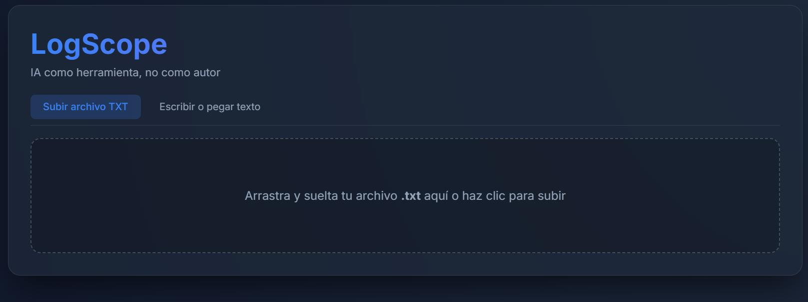

# LogScope Web

LogScope es una herramienta de análisis de logs diseñada bajo la filosofía de que "La IA es una herramienta, no un autor". Fue creada como parte del  Curso AI for Developers, separando estrictamente la lógica de validación de la interfaz gráfica.

## Arquitectura
El proyecto originalmente iba a ser una aplicación de escritorio `.exe` usando Tkinter. Sin embargo, para garantizar total compatibilidad con Linux (pensando en el entorno del coach) y ofrecer un diseño de nivel profesional, el proyecto se migró a una arquitectura web local usando:
- **Python (Flask)** como backend.
- **HTML/CSS/JS (Vanilla)** como frontend, empleando técnicas de diseño moderno como el *Glassmorphism* (efecto cristal) y *Chart.js* para visualización de datos.

## ¿Cómo ejecutar el proyecto?
1. Abre tu terminal o consola en esta carpeta.
2. Asegúrate de tener instalado Flask:
   ```bash
   pip install flask
   ```
3. Ejecuta el servidor:
   ```bash
   python main.py
   ```
4. Abre tu navegador y dirígete a: **http://localhost:5000**

## Características
- **Drag & Drop**: Sube archivos `.txt` arrastrándolos a la pantalla.
- **Entrada de Texto Libre**: Pega logs directamente en el editor sin crear archivos. El backend maneja archivos temporales por detrás para reutilizar las mismas reglas sin duplicar código.
- **Validación Estricta**: Verifica fechas reales en el calendario (rechaza `2025-02-30`) y normaliza niveles de severidad (INFO, WARNING, ERROR).
- **Filtros Inmediatos**: Navega entre líneas malformadas o tipos de severidad al instante, viendo el texto original y el motivo exacto del fallo.


