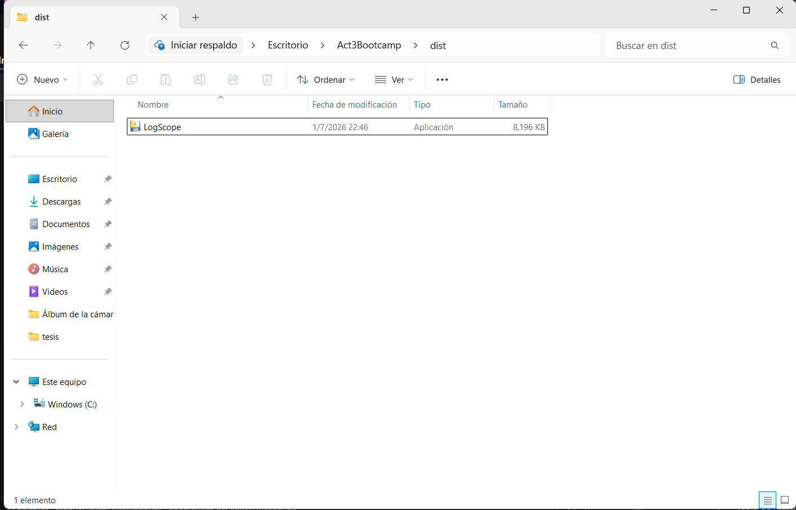
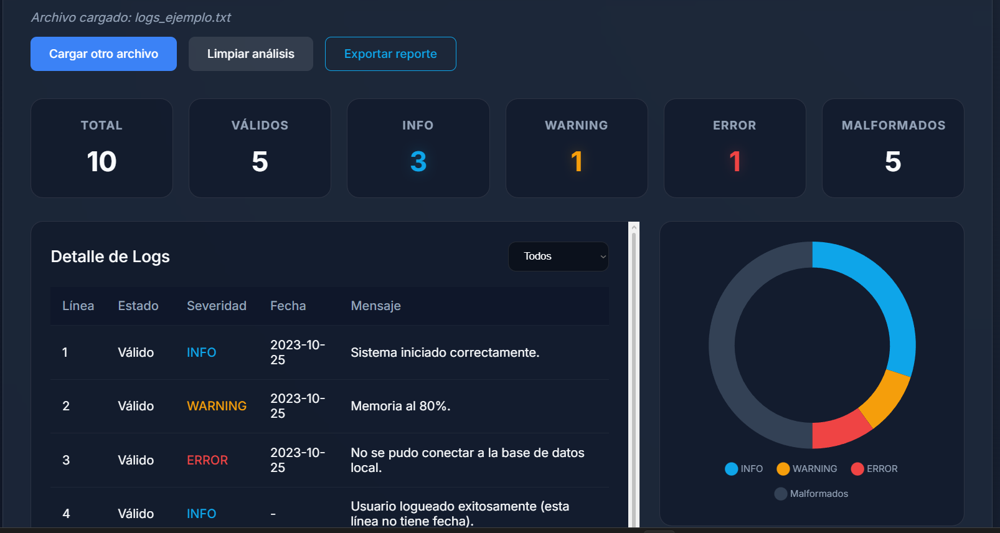

# Reflexión Técnica - LogScope Web

## 1. Colaboración Humano-IA (Delimitación de Responsabilidades)
En este proyecto, se aplicó el principio rector: *"La IA es una herramienta, no un autor"*. 
Para asegurar esto, el desarrollo inició estableciendo un documento estricto de reglas de negocio (`DECISIONES.md`) escrito y aprobado por mí como desarrollador. 

- **Rol del Estudiante:** Fui el arquitecto del sistema. Tomé decisiones críticas de diseño, como la separación estricta del núcleo (`analyzer.py`) y la interfaz (`main.py` / HTML), los modelos de transferencia de datos (`ResumenAnalisis`), y la decisión del pivote tecnológico (de `.exe` a Web), y creación del Documento DESICIONES.md.
- **Rol de la IA:** Actuó como un *junior developer* (o asistente de *vibecoding*), escribiendo la sintaxis repetitiva, generando las clases CSS y acatando sin objeciones las directrices del documento de decisiones. No se le permitió inventar reglas de negocio ni alterar el comportamiento esperado.

## 2. Ejemplos de Corrección y Orientación a la IA
Durante el desarrollo, la IA propuso soluciones estándar que tuvieron que ser corregidas o redirigidas por mí para asegurar la calidad del producto:

**Ejemplo A: Validación de Fechas Imposibles**
Al pedirle extraer la fecha del log, la IA inicialmente propuso usar únicamente una expresión regular matemática (`\d{4}-\d{2}-\d{2}`). 
- *Problema detectado:* Noté que una expresión regular daría por válida la fecha `2025-02-30`, la cual no existe en el calendario. 
- *Corrección:* Ordené a la IA no confiar en la regex y forcé la implementación de `datetime.strptime()` para validar la existencia real en el calendario, categorizando fechas absurdas como "Líneas malformadas". (Ver comentarios en `analyzer.py`).

**Ejemplo B: El Pivote de Escritorio (.exe) a Web App**
Originalmente, el plan incluía exportar la aplicación de escritorio Tkinter a un `.exe` usando PyInstaller.

- *Problema detectado:* Me di cuenta de que mi coach evaluador probablemente utilizaría Linux. Un ejecutable `.exe` cerrado rompería la versatilidad del proyecto. 
- *Corrección:* Decidí detener el flujo de la IA y cambiar radicalmente la arquitectura. Le ordené conservar el núcleo (`analyzer.py`) intacto y reescribir la interfaz como un servidor **Flask** local con un frontend web moderno. Esto demostró control total sobre la arquitectura del software. Además, al pedirle analizar texto libre en la web, obligué a la IA a usar *archivos temporales en RAM* en lugar de permitirle duplicar mi código de validación, asegurando la integridad del sistema.

## 3. Aprendizaje sobre el uso de la IA
Este proyecto me demostró que el *vibecoding* es inútil si el humano no sabe lo que quiere. La IA puede escribir mil líneas de código en segundos, pero si no se define una arquitectura, interfaces claras, y casos límite (como un usuario metiendo barras en lugar de guiones), el sistema colapsará. La IA me ayudó a ir 10 veces más rápido en tareas de tipado e interfaz gráfica, pero la solidez funcional de LogScope fue 100% mi diseño.

## 4. Evidencia de Pruebas
He incluido dos archivos en el proyecto para validar el sistema:

1. **`logs_bien_formado.txt`**
   - *Descripción:* Un archivo que contiene únicamente eventos perfectos. Incluye casos donde la severidad está entre corchetes, otros donde no lo está, y líneas sin fecha (lo cual es legal en las reglas).
   - *Resultado esperado:* 0 Malformados, todos contados correctamente en Válidos.
   - *Resultado obtenido:* Efectivamente, el analizador lo lee sin emitir errores de validación y la gráfica web se pinta limpia.

2. **`logs_ejemplo.txt`**
   - *Descripción:* Un archivo trampa (edge cases). Contiene fechas mal escritas (barras `/`), severidades inventadas (`[debug]`), líneas en blanco, y fechas imposibles (`2025-02-30`).
   
   
   - *Resultado esperado:* Debe identificar cada error sin colapsar el programa, categorizarlos como Malformados y explicar el motivo en el panel de detalles.
   - *Resultado obtenido:* El script no se rompe. Clasifica como inválidas las fechas falsas y el nivel `[debug]`, mostrando exactamente la regla violada en la interfaz visual.
